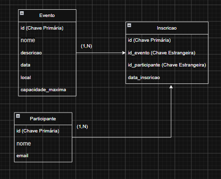

# Sistema de Gerenciamento de Eventos e Inscrições

Este sistema em Spring Boot gerencia eventos, participantes e inscrições com controle de vagas limitadas.

## Tecnologias
* Java
* Spring Boot
* Banco de Dados  MySQL
* Maven

## Como Executar
1. Clone o repositório: git clone <url-do-repositorio>
2. Entre na pasta do projeto pelo IntelliJ IDEA
3. Rode o arquivo: src/main/java/com/eventos/EventosApplication.java
4. Acesse pelo swagger: http://localhost:8080/swagger-ui/index.html#/

## Diagrama (DER)
O Diagrama Entidade-Relacionamento está localizado na raiz do projeto como der.png ou der.pdf.




## Endpoints da API

### Eventos

| Método | Endpoint                     | Descrição                                        | RF   |
|--------|--------------------------------|------------------------------------------------------|------|
| POST   | `/eventos`                    | Cadastra um evento                                    | RF01 |
| GET    | `/eventos`                    | Lista todos os eventos                                | RF02 |
| GET    | `/eventos/{id}`                | Consulta um evento (inclui `vagasDisponiveis`)         | RF03 |
| GET    | `/eventos/{id}/participantes`  | Lista os participantes inscritos no evento             | RF06 |

Exemplo de corpo para `POST /eventos`:

```json
{
  "nome": "Workshop de Spring Boot",
  "descricao": "Introdução prática ao Spring Boot",
  "data": "2026-10-20",
  "local": "Auditório 1",
  "capacidadeMaxima": 30
}
```

### Participantes

| Método | Endpoint             | Descrição                        | RF   |
|--------|------------------------|-------------------------------------|------|
| POST   | `/participantes`       | Cadastra um participante            | RF04 |
| GET    | `/participantes`       | Lista todos os participantes        | -    |
| GET    | `/participantes/{id}`   | Consulta um participante específico | -    |

Exemplo de corpo para `POST /participantes`:

```json
{
  "nome": "Maria Silva",
  "email": "maria.silva@email.com"
}
```

### Inscrições

| Método | Endpoint             | Descrição                                     | RF   |
|--------|------------------------|--------------------------------------------------|------|
| POST   | `/inscricoes`          | Inscreve um participante em um evento             | RF05 |
| GET    | `/inscricoes`          | Lista todas as inscrições                         | -    |
| DELETE | `/inscricoes/{id}`      | Cancela uma inscrição                             | RF07 |

Exemplo de corpo para `POST /inscricoes`:

```json
{
  "eventoId": 1,
  "participanteId": 1
}
```

## Regras de Negócio

* **RN01** — Inscrição permitida apenas se houver vaga (`inscrições ativas < capacidadeMaxima`). Retorna `400 Bad Request` se o evento estiver lotado.
* **RN02** — Proibido inscrever o mesmo participante duas vezes no mesmo evento (`400 Bad Request`; reforçado também por constraint `UNIQUE` no banco).
* **RN03** — Cada participante deve ter um e-mail único (`400 Bad Request`; reforçado também por constraint `UNIQUE` no banco).
* **RN04** — O cancelamento da inscrição (`DELETE /inscricoes/{id}`) libera a vaga imediatamente, pois `vagasDisponiveis` é sempre recalculado a partir da quantidade atual de inscrições do evento.

## Códigos de resposta

* `200 OK` — consulta/listagem bem-sucedida
* `201 Created` — recurso criado com sucesso
* `204 No Content` — inscrição cancelada com sucesso
* `400 Bad Request` — violação de regra de negócio (RN01, RN02, RN03) ou dados inválidos
* `404 Not Found` — evento, participante ou inscrição não encontrados
 